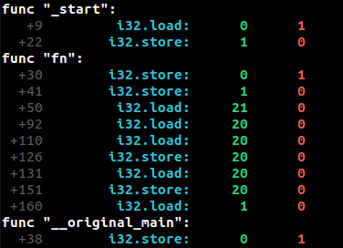

# Cache Simulation

The goal of this task is to implement a Wizard monitor to simulate a hardware cache. Cache simulation is incredibly useful in
understanding spatial and temporal data locality properties of program. Your cache will have the following specifications:
* Size: 1 MB
* Associativity: 4 way set-associative
* Block Size: 128 byte block
* Replacement Policy: LRU

As with hardware caches, you will begin with a cold-start (i.e, the cache is empty when the module begin).

## Output Format for Grading:

### 1. Function Header Output:
- Use the helper method `output_func_header()` to print each function's header.
- The **function headers must be printed in increasing order of function index** (e.g., Func0, Func1, Func2, ...).
- **Ensure** that the function header is printed **before** the corresponding cache statistics.

### 2. CacheStat Output:
- After printing each function header, use the helper method `output_cache_stat()` to print the cache statistics.
- The **cache statistics must be printed in increasing order of the program counter (pc)** for each function.

## Important Notes:
- The **correct order of output** is essential for grading.
- Output **must follow** the specified structure of increasing function index and program counter.
- **Do not invoke any other output functions** besides the methods specified above.
- **Double-check your output** to ensure it matches the expected format, as incorrect output will result in lost points.

## Sample Output

## FAQ

* Do we need to handle memory accesses that span cache block boundaries?
> Yes, some accesses may span multiple cache lines
* Do we need to include instructions from wasm extensions (atomics, bulk-memory instructions etc.)?
> No
