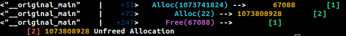

# Malloc Profiling

In this task, you will implement a Wizard monitor to profile memory allocation primitives (e.g. malloc/free), and report these
events to the user during execution.

The monitor will be provided the name of the allocation function and the name of the free function as arguments. You can
assume that the address passed into the malloc function and the free function are exactly the same.
You will monitor the address of allocations, their size, as well as the corresponding free function invocation that deallocates it.

## Output Format for Grading:

### Allocation Tracking Overview:
Each memory allocation is tracked using a **unique, sequentially incremented id** that starts with 1. This id will be used when invoking the output helper methods as specified below.

### 1. Allocation Record Output:
- Use the helper method `output_alloc_record()` **after** the alloc function completes.
- The argument passed to `output_alloc_record()` **must include the unique id** assigned to the allocation.
- Ensure that the id is **sequentially incremented**, starting from **1**, for each new allocation.

### 2. Free Record Output:
- Use the helper method `output_free_record()` **after** the free function completes.
- The argument passed to `output_free_record()` **must include the id** of the respective allocation call that is being freed.
- If no corresponding allocation call can be mapped, the id should be set to **0**.

### 3. Unfreed Allocation Output:
- After the program execution completes, use the helper method `output_unfreed_alloc_record()` to print all unfreed memory allocations.
- The **unfreed allocations must be printed in ascending order of their allocation id**.

## Important Notes:
- The **correct invocation and order of output** are essential for grading.
- The unfreed allocations **must follow** the specified order based on their allocation id.
- **Do not invoke any other output functions** besides the methods specified above.
- **Double-check your output** to ensure it meets the required format, as incorrect output will result in lost points.
- Make sure to escape the monitor args when invoking from CLI (otherwise bash will expand the curly braces)
  - E.g: `./bin/wizeng '--monitors=malloc{a=malloc,f=free}' ...`

## Generating Tests
The easiest method will be to use [WASI](https://github.com/WebAssembly/wasi-sdk) with C/Rust toolchains.
WASI often uses the function `dlmalloc` as opposed to `malloc` to allocate memory within libc, so prefer instrumenting the former.
Deallocation is usually performed with `dlfree`.

## Sample Output

## FAQ

* Do we need to handle malloc/free invocations from a host callsite?
> Assume that malloc/free are only called from the wasm context for this project
* Do we report the callsite or return point of the malloc/free call?
> Call site
* How do we handle double frees?
> Report ID as 0 for subsequent unmapped frees after the first one
